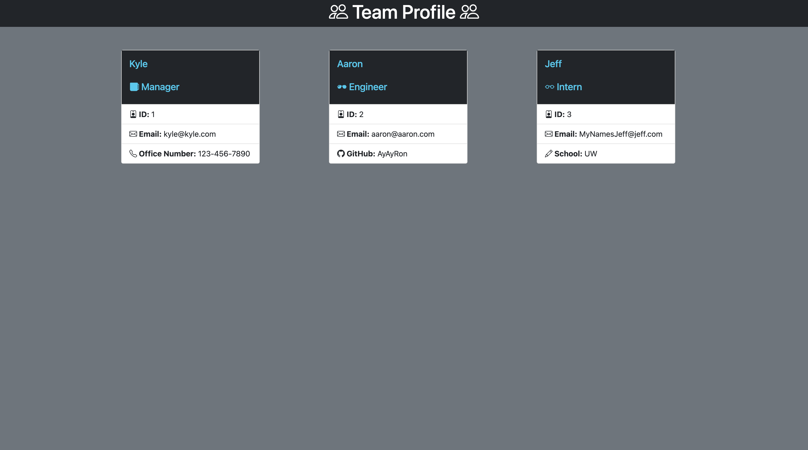

# Team-Profile-Generator

## Description

This application uses commmand line input, Node, and .Inquirer to create a software engineering team profile. Jest is also used to test and ensure the code passes.

Users are prompted by the application to provide information regarding team members. Users will provide the team member's name, role, id, email, and/or office number, GitHub username, or school. Users will then be asked if another member will be added. Once all members have been added an HTML file will be generated with the information provided.

## Table of Contents

- [Description](#description)
- [Installation](#installation)
- [Usage](#usage)
- [License](#license)
- [Questions](#questions)
- [Links](#links)

## Installation

1. Clone Team-Profile-Generator repo from GitHub.
2. Access repo using the command line.
3. In the terminal run `npm i`

## Usage

1. Access Team Profile Generator through the command line on your local machine.
2. Run `node index.js` to begin Inquirer prompts.
3. Answer each question to add a team member.
4. When all team members have been added, go to the `./dist` directory and open the `index.html` file in the browser to view your team.

Demo

Screenshot shows sample html page

Gif showing the tests passing, the inquirer prompts in the command-line, and the generated html page.

https://drive.google.com/file/d/1jS7wwiNVZj4X6QxYy0BPhrPI2Rj2_rjX/view

## License

This application is covered by MIT License. For more information please refer to https://choosealicense.com/licenses/mit/

## Questions

- GitHub: [jkcanoy](https://github.com/jkcanoy).

- For more information please contact kylecanoy96@gmail.com
